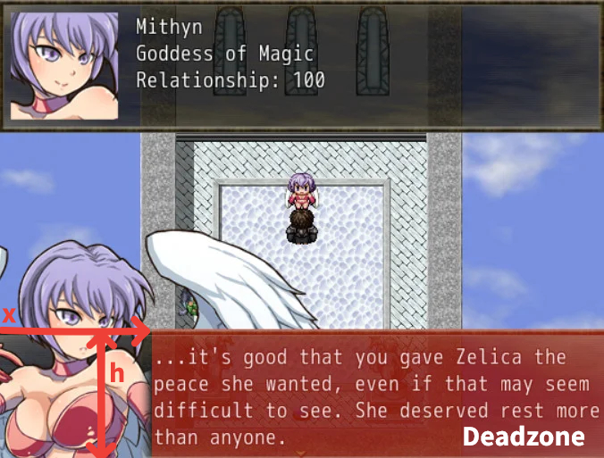
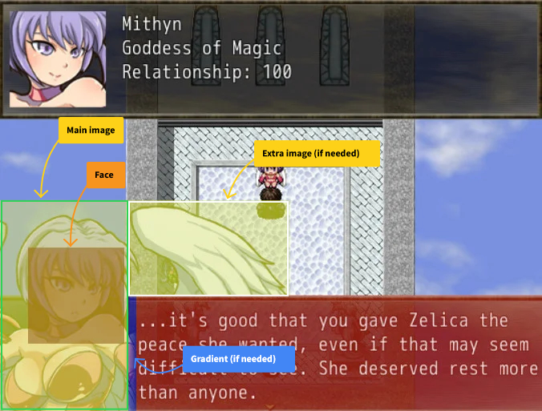

## Assets setup

Drop the `Graphics/` folder to the root of your project. This will do the following:
- Create a `busts/` folder (under `Pictures/`) with all the properly resized (and sometimes altered) busts ready for display.
- Update a few facesets (e.g. Simon, Orcent) and sprites (Hester) for consistency.
- Create a `battle/` folder (under `Pictures/`), for all images related to the new battle features (can be safely deleted if you don't use those)

That folder also contains some other new and updated assets to match the bust system, including the corresponding full-size busts.

## Busts for dialogues

Add the following scripts to your project:
- Rachnera Message Bust
- Bust Config

### Manually show a bust

Using the "Script" Event Command:

#### Display

```rb
$some_bust = Busty::Bust.new(z = 0)
$some_bust.draw(
  x = 140,
  y = -120,
  face_name = "Tertia emo",
  face_index = 2
)
```

Note: To accomodate with the fact busts tend to be snapped to the bottom, y = 0 corresponds with the bottom of the bust aligned with the bottom of the screen. Axis are however unchanged, hence the minus sign.

#### Change expression

Shortcut if you just need to change the character's expression without moving anything else.

```rb
$some_bust.draw_face(
  face_name = "Tertia emo",
  face_index = 7
)
```

#### Dispose

```rb
$some_bust.erase
$some_bust.dispose
$some_bust = nil
```

### Technical considerations

#### Dead zone

To make sure the bust never covers up the text, the code is given a dead zone, a part of the screen it is simply forbidden to overlap into in any capacity. This rectangular zone is in practice defined with basic x and h parameters, as per the following diagram:



In practice, this is achieved by taking the original image, cutting it to only keep what's left of the dead zone, cutting the remains to only keep what's above it, and putting the two images in the right spots.

In general, this feature is one big collage:



## Test the experimental combat features

Add the following scripts, in that order:
- Rachnera Battle Bust
- Battle Bust Config

This feature is (now) fully indepent of the other ones, and can be disabled safely on its own by removing these two scripts.

## Credits

Code by Rachnera

Inspired by [Hollow's Simple Message Busts](https://forums.rpgmakerweb.com/index.php?threads/simple-message-busts.45897/)

Configuration and image retouches by Decarabia and Lamsey
